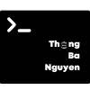

<p align="center">
  <a href="https://www.linkedin.com/in/tylrtnguyen/">
    
  </a>
</p>
<h1 align="center">
  The second version of my personal website
</h1>

## 🚀 Quick start

1.  **Install Node.js using NVM.**
    ```shell
    nvm install
    ```

2.  **Install the Gatsby CLI**
    ```shell
    npm install -g gatsby-cli
    ```
3.  **Install dependencies**
    ```shell
    npm install
    ```

4.  **Start development sever**

    Your site is now running at `http://localhost:8000`!
    ```shell
    npm run develop
    ```
    

## 💫 Build and Deploy for Production
1.  **Build a optimized version for production**
    ```shell
    npm run build
    ```
2.  **Preview the site as appeared when deploying**
    ```shell
    npm run serve
    ```
